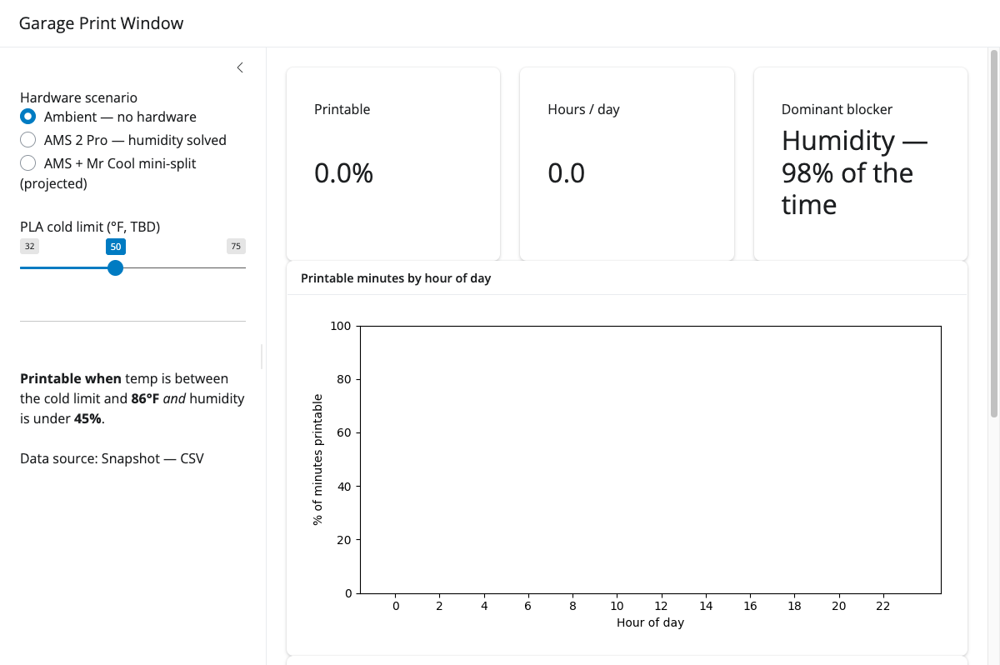
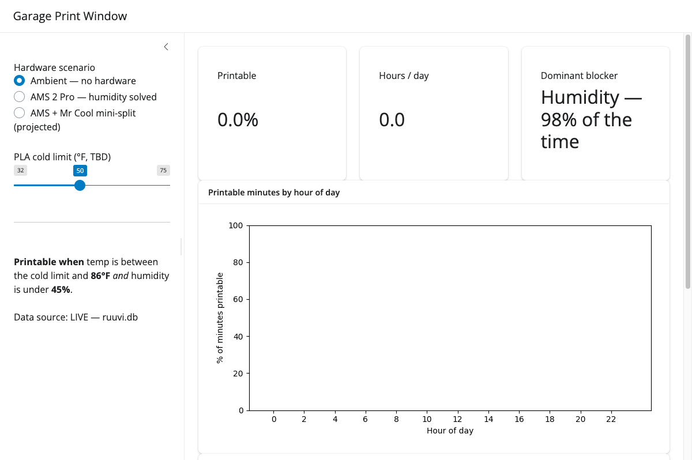

# Garage Print Window

**How many hours a day can I actually 3D print in a hot, humid Texas garage — and what hardware is worth buying to widen that window?**

I answered it with data from a sensor I built, and it has already changed what I've bought. The analysis and the decision memo run on [Posit](https://posit.co)'s open-source data-science stack — **Shiny for Python + Quarto** — which is the *how*; the point is the decision.

---

## The decisions this drove (the whole point)

This isn't a chart project. It's a closed loop: **question → what the data said → what I did → what changed → what's next.**

| Step | |
|---|---|
| **Question** | When can I reliably print? PLA needs dry filament *and* a workable ambient temperature. |
| **What the data said** | In July, the garage was printable **~0% of the time.** Humidity was the blocker **~98%** of the time; temperature was in range only 41.9%. When it was cool enough it was too humid, and when it was dry enough it was too hot — the two windows never overlapped. |
| **Decision 1 (done, $)** | Bought a **Bambu AMS 2 Pro** (sealed + desiccant + heated drying). Removes humidity as a variable. Modeled effect: printable window **~0% → ~42%** (now temperature-limited). |
| **What changed** | With humidity handled, **temperature is the only live constraint.** The question narrowed from two variables to one. |
| **Decision 2 (planned, $)** | A **Mr Cool DIY mini-split** to hold the garage inside the printable temperature band year-round — cooling below the heat limit in summer, heating above the cold limit in winter. The software's job is to **quantify the hours/day it buys, by season**, before I spend the money. |
| **What's next** | Pin down the PLA cold limit; accumulate seasonal data to turn the summer snapshot into an annual picture. |

Real data → real decisions → real dollars moved. That's the loop.

---

## The problem (why these thresholds)

Reliable PLA printing needs two things at once:

1. **Dry filament** — ambient humidity below ~**45% RH**. PLA is hygroscopic; absorbed moisture flashes to steam in the hot end → stringing, bubbles, poor layer adhesion.
2. **Ambient temperature in a band** — below ~**86°F** (heat → stringing, soft filament, heat creep) and above a **cold limit** (too cold → warping, poor adhesion). The cold limit is TBD and treated as a parameter.

---

## The data (July snapshot)

RuuviTag, ~1 reading/minute, ~10 days:

| Measure | Result |
|---|---|
| Printable at ambient (humidity <45% **and** temp <86°F) | **~0%** |
| Temperature OK (<86°F) | 41.9% (ranged 80.4°F → 106.9°F) |
| Humidity OK (<45%) | 1.6% (ranged 42.6% → 79.5%) |
| Dominant blocker | Humidity (~98% of the time) |

---

## The pipeline I built (sensor side)

RuuviTags broadcast over BLE only, so the ingestion chain is built end-to-end:

```
RuuviTag Pro (BLE)  →  ESP32 / ESPHome gateway (custom antenna)  →  MQTT (Mosquitto)  →  SQLite (Mac mini)
```

Boot-persistent daemons. Storage is tall/long: `readings(ts, device, metric, value)`; garage metrics are `garage_temperature` (°C), `garage_temp_f` (°F), `garage_humidity` (%).

Full hardware writeup: **[jpav88/ruuvi-esp32-homekit](https://github.com/jpav88/ruuvi-esp32-homekit)** — read out-of-range RuuviTags via a ~$6 ESP32; no Pi, no Docker, no $200 gateway.

---

## Built with Posit's stack

- **Shiny for Python** dashboard — printable-hours-by-hour-of-day, a temperature time-series with the band thresholds drawn, and scenario toggles (AMS applied; mini-split projected).
- **Quarto** report — the reproducible decision memo (question → data → method → findings → recommendation).
- Deployed free on shinyapps.io / Quarto Pub.

*Why Shiny for **Python**:* it runs Posit's signature framework in the language I write daily — and shows how low the barrier is to getting into their stack.

## From static snapshot to live data (validate, then step up)

Built in two deliberate steps — the same maturity curve I'd take a customer through:

1. **Validate on a static snapshot.** `extract_data.py` pulls the readings into a CSV extract — essentially a pivot table, the way you'd validate the logic in a spreadsheet first. Fast, reproducible, and it deploys anywhere.
2. **Step up to live.** Running on the Mac mini, the app reads the SQLite DB directly and refreshes on an interval — a near-realtime "live pivot table." Deployed remotely (no DB), it falls back to the snapshot automatically.

Same dashboard, whether it's a fixed extract or a live feed. Deploy steps: see [`DEPLOY.md`](DEPLOY.md).

### Output validation — same analysis, both sources

| 1. Static snapshot (CSV) | 2. Live database (ruuvi.db) |
|---|---|
|  |  |

*Both runs agree — ambient printability is ~0% (humidity blocks ~98% of the time). The only difference is the data source, shown bottom-left in each. ([analysis chart](output-validation/analysis_chart.png): printable hours by hour, ambient vs. AMS.)*

---

## Honest caveats

- **~10 days of peak-summer data so far** — proves the method and the summer case; annual conclusions need more history.
- **The PLA cold limit isn't pinned down yet** — the analysis is parameterized by it.
- **Ambient humidity stands in for the filament's environment** — valid pre-AMS, because exposed PLA equilibrates to ambient quickly, so the room reading *is* the filament's condition.

---

## Roadmap (kept intentionally small)

- Accumulate seasonal data; blend with historical Seabrook/Houston weather to project **annual** printable hours.
- Quantify the **mini-split ROI** (hours/day gained by season) and find the PLA cold limit.
- Optional action layer: auto-trigger AMS drying via the printer's **local MQTT API** (`ams_filament_drying`) when humidity crosses the threshold.

---

## Tools

**Posit:** Shiny for Python, Quarto. **Python:** pandas. **Data:** SQLite. Built human-directed with Claude Code — I specced the analysis in about 15 minutes because I already knew the shape of the answer; the tooling accelerated the build. Judgment leads; the tool executes.

## Status

Analysis and July findings complete; dashboard + Quarto report build in progress.
